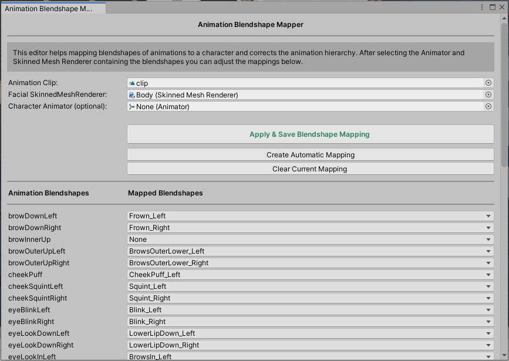

# unity-blendshape-mapper
A unity tool that helps mapping blendshape animations to characters.

## Features
 - Rename blendshape animations in unity animation clips
 - Remap blendshape animation hierarchy
 - Automatic Blendshape Mapping using fuzzy string matching
 
 ## Installation
 - Option A: Copy the Editor directory into your unity project
 - Option B: Download the unity package under releases and import into your Unity project

